SEMANA No 1 – DOSW Manejo de Streams

## Datos personales:

- **Nombre y Apellido: Jose Alejandro Martinez Arias**
- **Código de Estudiante: 1000104385**
- **Curso: DOSW**

---

### Ejercicio 01 – Filtrado de números pares mayores a 10

Filtrar de una lista de enteros aquellos números que sean pares y simultáneamente mayores a 10.

**Código implementado:**

```java
package semana_1.streams;

import java.util.List;

public class Ejercisio01 {


    public static void main(String[] args){
        List<Integer> numbers = List.of(3,8,10,12,15,18,20);

        // forma 1
        List<Integer> result = numbers.stream()
                .filter(n -> n % 2 == 0)
                .filter(n -> n > 10)
                .toList();

        System.out.println(result);

        // forma 2
        List<Integer> resultado = numbers.stream()
                .filter(n -> n  % 2 == 0 && n > 10)
                .toList();

        System.out.println(resultado);


    }
}
```

**Captura de ejecución:**

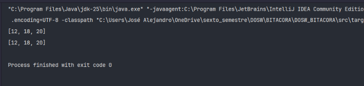

**Explicación:** Se utiliza la API de Streams sobre una lista de números enteros. Se aplican operaciones intermedias mediante `filter()` para seleccionar únicamente los elementos pares y mayores a 10. En la primera forma se encadenan dos llamados a `filter()`, mientras que en la segunda se combinan las condiciones en un único predicado con `&&`. Finalmente, la operación terminal `toList()` recolecta los datos resultantes.

---

### Ejercicio 02 – Procesamiento, transformación y conteo de cadenas

Dada una lista de cadenas de texto (palabras), filtrar aquellas con longitud mayor a 4 caracteres, convertirlas a mayúsculas, ordenarlas alfabéticamente y contar cuántos elementos cumplen el criterio.

**Código implementado:**

```java
package semana_1.streams;

import java.util.List;

public class Ejercisio02 {

    public static void main(String[] args){

        List<String> words = List.of("java","stream","api","functional","code","git");

        // forma 1
        List<String> processed = words.stream()
                .filter(w -> w.length() > 4)
                .map(String::toUpperCase)
                .sorted()
                .toList();

        long count = processed.stream().count();

        System.out.println(processed);
        System.out.println(count);

        // forma 2
        long cantidad = words.stream()
                .filter(w -> w.length() > 4)
                .map(String::toUpperCase)
                .sorted()
                .peek(System.out::println)
                .count();

        System.out.println(cantidad);
    }
}
```

**Captura de ejecución:**

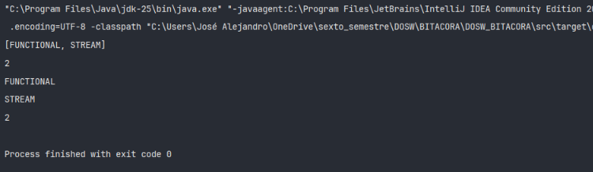

**Explicación:** Se filtra el stream de palabras conservando solo las que tienen una longitud estrictamente mayor a 4 (`w.length() > 4`). Luego se realiza una transformación con `map(String::toUpperCase)` a mayúsculas y se ordenan con `sorted()`. Se presentan dos formas: una recolectando a lista y obteniendo el tamaño, y otra usando `peek()` para imprimir mientras se realiza la operación terminal de conteo `count()`.

---

### Ejercicio 03 – Filtrado y ordenamiento de usuarios activos

Dada una lista de objetos de tipo `User`, obtener los nombres en mayúsculas de todos los usuarios cuyo estado sea activo (`isActive == true`), retornándolos ordenados alfabéticamente.

**Código implementado:**

```java
package semana_1.streams;

import java.util.List;

public class Ejercisio03 {

    public static void main(String[] args){

        List<User> users = List.of(new User(100010202,"Jose",10,true),
                new User(34242424,"Alex",34,false),
                new User(342424242,"Pepe",324,true),
                new User(4636363,"Fernanada",342,true),
                new User(58594202,"Joselito",32425,true)
        );

        // forma 1
        List<String> result = users.stream()
                .filter(User::isActive)
                .map(User::getName)
                .map(String::toUpperCase)
                .sorted()
                .toList();

        System.out.println(result);

        // forma 2
        List<String> resultado = users.stream()
                .filter(User::isActive)
                .map(u -> u.getName().toUpperCase())
                .sorted()
                .toList();

        System.out.println(resultado);


    }
}
```

**Captura de ejecución:**

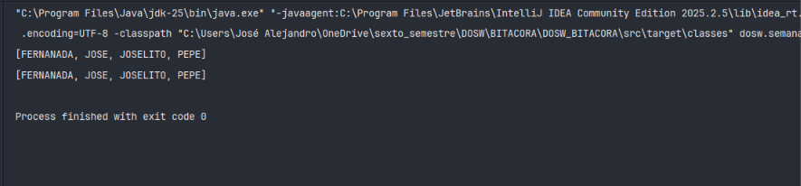

**Explicación:** Se filtra el stream de usuarios evaluando la propiedad activa mediante `User::isActive`. Posteriormente, se transforma cada objeto `User` a su atributo `name` en mayúsculas y se ordena la lista alfabéticamente con `sorted()`. El resultado se consolida en una lista utilizando la operación terminal `toList()`.

---

### Ejercicio 04 – Obtención de nombres de usuarios mayores de edad

Filtrar de una lista de objetos `User` a aquellos que tengan una edad igual o superior a 18 años (`age >= 18`) y extraer únicamente sus nombres.

**Código implementado:**

```java
package semana_1.streams;

import java.util.List;

public class Ejercisio04 {

    public static void main(String[] args){

        List<User> users = List.of(
                new User(1, "Carlos", 17, true),
                new User(2, "ana", 30, false),
                new User(3, "miguel", 15, true),
                new User(4, "beatriz", 28, true),
                new User(5, "juan", 35, true)
        );

        List<String> resultado = users.stream()
                .filter(u -> u.getAge() >= 18)
                .map(User::getName)
                .toList();

        System.out.println(resultado);
    }
}
```

**Captura de ejecución:**

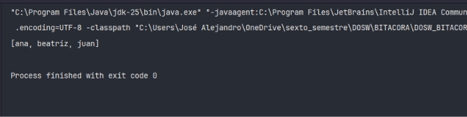

**Explicación:** Se aplica la operación `filter` con el predicado `u -> u.getAge() >= 18` sobre el stream de objetos `User`. A continuación, se extrae la propiedad del nombre de cada usuario que cumple la condición utilizando `map(User::getName)` y se recolecta el resultado final en una lista de cadenas con `toList()`.

---

### Ejercicio 05 – Verificación de transacciones no aprobadas

Dada una lista de objetos `Transaction`, determinar si existe al menos una transacción que no haya sido aprobada (`isApproved == false`).

**Código implementado:**

```java
package semana_1.streams;

import java.util.List;

public class Ejercisio05 {


    public static void main(String[] args){
        List<Transaction> transactions = List.of(
                new Transaction("TX-001", 120.50,true),
                new Transaction("tx-002", 350.00, true),
                new Transaction("TX-003", 90.25, false),
                new Transaction("TX-004", 500.00, true)
        );

        boolean hasUnapprovedTransaction = transactions.stream()
                .peek(System.out::println)
                .anyMatch(transaction -> !transaction.isApproved());

        System.out.println(hasUnapprovedTransaction);
    }
}
```

**Captura de ejecución:**

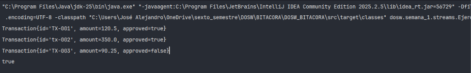

**Explicación:** Se convierte la lista de transacciones en un stream y se hace uso de `peek()` para imprimir cada elemento evaluado en pantalla. La evaluación principal se efectúa mediante la operación terminal `anyMatch()`, pasando como condición `!transaction.isApproved()`. Esta operación devuelve un resultado booleano (`true` si encuentra al menos una transacción no aprobada, de lo contrario `false`).


# SEMANA No 2 – Bitácora Pokémon

## Datos de Entrenador:

- **Nombre y Apellido:** Jose Alejandro Martinez Arias
- **Código de Estudiante:** 1000104385
- **Curso:** DOSW

---

> [!TIP]
> ### RETO LEGENDARIO (+0.5 puntos)
>
> **Resolución de ejercicios utilizando Method References (`::`) con Azúcar Sintáctico:**
> Se implementó Method Reference en **11 ejercicios** (superando el mínimo de 5 requeridos):
>
> -  **Ejercicio 02**: `.map(String::toUpperCase)`
> -  **Ejercicio 03**: `.reduce(0, Integer::sum)`
> -  **Ejercicio 10**: `.map(Pokemon::getNombre)` y `Collectors.toCollection(ArrayList::new)`
> -  **Ejercicio 11**: `.mapToDouble(Double::parseDouble)`
> -  **Ejercicio 13**: `TreeMap::new` (referencia a constructor)
> -  **Ejercicio 14**: `LinkedHashMap::new` (referencia a constructor)
> -  **Ejercicio 15**: `Comparator.comparing(Entrenador::getMedallas)`
> -  **Ejercicio 17**: `Comparator.comparing(Entrenador::getSumTotalPowerTeam)`
> -  **Ejercicio 18**: `Comparator.comparing(Pokemon::getPoderCombate)`
> -  **Ejercicio 19**: `Comparator.comparing(Entrenador::getMedallas).thenComparing(...)`
> -  **Ejercicio 20**: `Pokemon::getTipo`, `LinkedHashMap::new`, `Pokemon::getRegion`, `Pokemon::isLegendario`, `Pokemon::getNivel`, `Pokemon::getPoderCombate`

> [!IMPORTANT]
> ### RETO MEWTWO (+1.0 punto)
>
> **Operación Táctica: Sistema de Proyección y Élite Regional**
> Se desarrolló un ejercicio propuesto que combina en un único flujo de Streams: `filter()`, `map()`, `sorted()`, `groupingBy()` y `reduce()`.
> Ver detalle al final del documento en la sección [RETO MEWTWO (+1.0 punto)](#-reto-mewtwo-10-punto--operación-táctica-sistema-de-proyección-y-élite-regional).

---

### Ejercicio 01 – Filtrado de Pokémon tipo Fuego por Parsing de Texto

Dada una lista de Pokémon representados como texto con su tipo entre paréntesis (ej. `"Charmander(Fuego)"`), filtrar aquellos que sean de tipo Fuego (sin importar mayúsculas/minúsculas) y extraer únicamente el nombre del Pokémon.

**Código implementado:**

```java
package semana_2.pokemon;

import java.util.List;

public class Ejercisio1 {

    public static void main(String[] args){

        List<String> pokemons = List.of("Pikachu(Eléctrico)", "Charmander(Fuego)",
                "Squirtle(Agua)", "Vulpix(Fuego)",
                "Bulbasaur(Planta)", "Flareon(Fuego)"
        );

        List<String> pokemonsTypeFire = pokemons.stream().filter(pokemon ->
                        pokemon.substring(pokemon.indexOf("(") + 1,
                        pokemon.indexOf(")")).equalsIgnoreCase("fuego"))
                        .map(pokemon -> pokemon.substring(0,pokemon.indexOf("(")))
                        .toList();

        System.out.println(pokemonsTypeFire);
    }
}
```

**Captura de ejecución:**

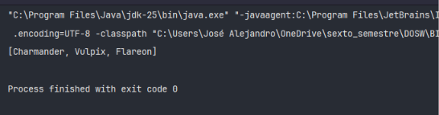

**Explicación:** Se procesa una lista de cadenas extrayendo la subcadena delimitada por paréntesis `indexOf("(") + 1` e `indexOf(")")` para obtener el tipo del Pokémon. Se evalúa `equalsIgnoreCase("fuego")` en `filter()` y posteriormente se utiliza `map()` con `substring(0, indexOf("("))` para obtener únicamente el nombre del Pokémon.

---

### Ejercicio 02 – Transformación de Nombres a Mayúsculas  [Method Reference]

Dada una lista de nombres de Pokémon, convertir todos los nombres a letras mayúsculas utilizando Streams.

**Código implementado:**

```java
package semana_2.pokemon;

import java.util.List;

public class Ejercisio2 {

    public static void main(String[] args){

        List<String> pokemon = List.of("Pikachu", "Charmander", "Squirtle", "Bulbasaur");

        List<String> pokemonUpperCase = pokemon.stream().map(String::toUpperCase).toList();

        System.out.println(pokemonUpperCase);
    }
}
```

**Captura de ejecución:**

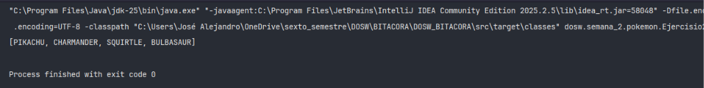

**Explicación:** Se aplica la operación `map(String::toUpperCase)` sobre el stream para transformar cada nombre a mayúsculas y finalmente se recolecta el resultado con `toList()`.

---

### Ejercicio 03 – Suma Total de Niveles de Pokémon  [Method Reference]

Dada una lista de niveles numéricos de Pokémon, calcular la suma total de los niveles utilizando la operación `reduce`.

**Código implementado:**

```java
package _2.pokemon;

import java.util.List;

public class Ejercisio3 {

    public static void main(String[] args){

        List<Integer> pokemonLevels  = List.of(45, 62, 38, 71, 55, 29);

        int sumLevels = pokemonLevels.stream()
                .reduce(0, Integer::sum);

        System.out.println("suma total de niveles: " + sumLevels);
    }
}
```

**Captura de ejecución:**

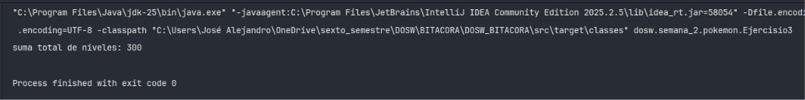

**Explicación:** Se utiliza la operación terminal `reduce(0, Integer::sum)` iniciando con valor semilla 0 y acumulando la suma de cada nivel de la lista.

---

### Ejercicio 04 – Identificación del Pokémon Alfa (Nivel Máximo)

Dada una lista de Pokémon codificados con su nivel entre paréntesis, encontrar el Pokémon de mayor nivel (Pokémon Alfa) utilizando `max()` y un `Comparator`.

**Código implementado:**

```java
package _2.pokemon;

import java.util.Comparator;
import java.util.List;
import java.util.function.Function;

public class Ejercisio4 {

    public static void main(String[] args){

        List<String> pokemons = List.of("Pikachu(45)", "Charmander(62)",
                "Squirtle(38)", "Snorlax(90)", "Mewtwo(88)"
        );

        Function<String,Integer> getLevel = pokemon -> {
            String substring = pokemon.substring(pokemon.indexOf("(") + 1, pokemon.indexOf(")"));
            return Integer.parseInt(substring);
        };

        String pokemonAlfa = pokemons.stream().max(Comparator
                .comparing(getLevel)).orElse("0");

        System.out.println("Pokemon Alfa: " + pokemonAlfa.substring(0,pokemonAlfa.indexOf("(")) + " (nivel " + getLevel.apply(pokemonAlfa) + ")");
    }
}
```

**Captura de ejecución:**

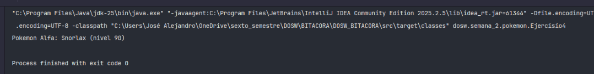

**Explicación:** Mediante una función lambda `getLevel` se parsea el nivel contenido entre paréntesis como entero. Se emplea `max(Comparator.comparing(getLevel))` para determinar cuál elemento posee el mayor nivel.

---

### Ejercicio 05 – Conteo y Filtrado de Pokémon de Nivel Superior a 80

Dada una lista de Pokémon con sus niveles, obtener la cantidad y nombres de aquellos Pokémon cuyo nivel sea strictly mayor a 80.

**Código implementado:**

```java
package _2.pokemon;

import java.util.List;
import java.util.function.Function;

public class Ejercisio5 {

    public static void main(String[] args){

        List<String> pokemons = List.of("Pikachu(45)", "Mewtwo(88)", "Dragonite(82)",
                "Squirtle(38)", "Mew(85)", "Charmander(62)"
        );

        Function<String,Integer> getLevel = pokemon -> {
            String substring = pokemon.substring(pokemon.indexOf("(") + 1, pokemon.indexOf(")"));
            return Integer.parseInt(substring);
        };

        List<String> pokemonsLevel80 = pokemons.stream()
                .filter(pokemon -> getLevel.apply(pokemon) > 80)
                .map(pokemon -> pokemon.substring(0,pokemon.indexOf("(")))
                .toList();

        System.out.println("Pokemon con nivel > 80: " + pokemonsLevel80.stream().count());
        System.out.println(pokemonsLevel80);
    }
}
```

**Captura de ejecución:**

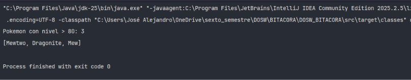

**Explicación:** Se extrae el nivel numérico de cada cadena y se aplica un filtro `getLevel.apply(pokemon) > 80`. Luego se mapea para conservar solo los nombres y se cuenta la cantidad total de coincidencias.

---

### Ejercicio 06 – Eliminación de Nombres Duplicados de Pokémon

Dada una lista de Pokémon con nombres repetidos, eliminar los duplicados para obtener una lista con elementos únicos.

**Código implementado:**

```java
package _2.pokemon;

import java.util.List;

public class Ejercisio6 {

    public static void main(String[] args){

        List<String> pokemons = List.of("Pikachu", "Charmander", "Pikachu",
                "Squirtle", "Charmander", "Mewtwo"
        );

        List<String> pokemonsUnique = pokemons.stream().distinct().toList();

        System.out.println(pokemonsUnique);
    }
}
```

**Captura de ejecución:**

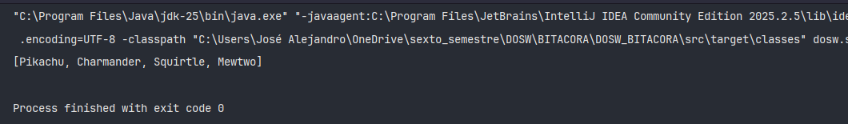

**Explicación:** La operación intermedia `distinct()` compara los elementos mediante `equals()` y remueve las apariciones duplicadas en el stream.

---

### Ejercicio 07 – Ordenamiento Alfabético de Pokémon

Ordenar una lista de nombres de Pokémon en orden alfabético ascendente.

**Código implementado:**

```java
package _2.pokemon;

import java.util.List;

public class Ejercisio7 {

    public static void main(String[] args){

        List<String> pokemons = List.of("Squirtle", "Pikachu", "Mewtwo",
                "Bulbasaur", "Charmander", "Abra"
        );

        List<String> pokemonsOrganizedAlphabetic = pokemons.stream().sorted().toList();

        System.out.println(pokemonsOrganizedAlphabetic);
    }
}
```

**Captura de ejecución:**

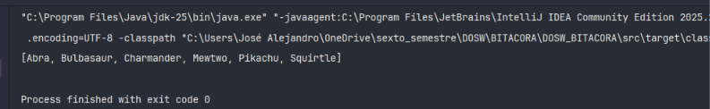

**Explicación:** Se utiliza la operación `sorted()` sin argumentos para aplicar el ordenamiento natural (alfabético para `String`).

---

### Ejercicio 08 – Filtrado de Pokémon Listos para Evolucionar

Dada una lista de Pokémon con su estado de evolución entre paréntesis (ej. `"Pikachu(true)"`), obtener la lista de nombres de aquellos que estén listos para evolucionar (`true`).

**Código implementado:**

```java
package _2.pokemon;

import java.util.List;
import java.util.function.Function;

public class Ejercisio8 {

    public static void main(String[] args){

        List<String> pokemons = List.of("Pikachu(true)", "Raichu(false)",
                "Charmander(true)", "Charizard(false)",
                "Squirtle(true)", "Blastoise(false)"
        );

        Function<String,String> getEvolution = pokemon -> {
            return pokemon.substring(pokemon.indexOf("(") + 1, pokemon.indexOf(")"));
        };

        List<String> pokemonsReadyToEvolutionated = pokemons.stream()
                .filter(pokemon -> getEvolution.apply(pokemon).equalsIgnoreCase("true"))
                .map(pokemon -> pokemon.substring(0,pokemon.indexOf("(")))
                .toList();

        System.out.println("Listos para evolucionar:");
        System.out.println(pokemonsReadyToEvolutionated);
    }
}
```

**Captura de ejecución:**

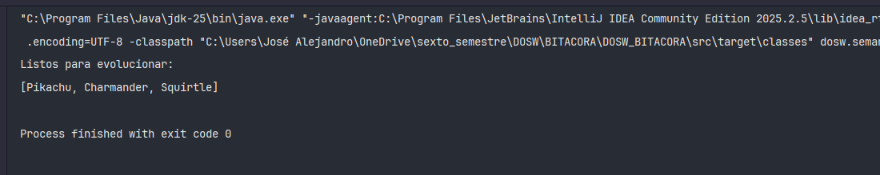

**Explicación:** Se extrae el indicador booleano en texto entre paréntesis y se filtra comparando con `"true"`. Luego se mapea para conservar únicamente el nombre del Pokémon.

---

### Ejercicio 09 – Selección de Equipo Élite (PC > 500)

Dada una lista de Pokémon con su poder de combate `PC` en texto (ej. `"Mewtwo(PC:680)"`), filtrar los Pokémon con `PC > 500` y formatear el resultado.

**Código implementado:**

```java
package _2.pokemon;

import java.util.List;
import java.util.function.Function;

public class Ejercisio9 {

    public static void main(String[] args){

        List<String> pokemons = List.of(
            "Pikachu(PC:320)", "Mewtwo(PC:680)",
            "Dragonite(PC:530)", "Squirtle(PC:210)",
            "Gengar(PC:495)", "Charizard(PC:610)"
        );

        Function<String,Integer> extractPowerPokemon = pokemon -> {
            String powerPokemon = pokemon.substring(pokemon.indexOf(":") + 1,pokemon.indexOf(")"));
            return Integer.parseInt(powerPokemon);
        };

        List<String> pokemonHighPower500 = pokemons.stream()
                .filter(pokemon -> extractPowerPokemon.apply(pokemon) > 500)
                .map(pokemon -> pokemon.substring(0,pokemon.indexOf("(")) + "(" + extractPowerPokemon.apply(pokemon) + ")")
                .toList();

        System.out.println("Equipo Elite (PC > 500):");
        System.out.println(pokemonHighPower500);
    }
}
```

**Captura de ejecución:**

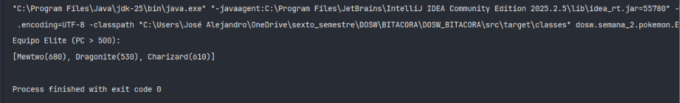

**Explicación:** Se realiza parsing de la subcadena posterior al carácter `:` para obtener el valor numérico de PC. Se aplican `filter()` para `PC > 500` y `map()` para estructurar el nombre y su valor correspondiente.

---

### Ejercicio 10 – Mapeo y Recolección en Colección Personalizada  [Method ]

Dada una lista de objetos `Pokemon`, extraer la lista de nombres y recolectarlos específicamente en una instancia de `ArrayList`.

**Código implementado:**

```java
package _2.pokemon;

import java.util.ArrayList;
import java.util.List;
import java.util.stream.Collectors;

public class Ejercisio10 {

    public static void main(String[] args){

        List<Pokemon> pokemons = List.of(
                new Pokemon(1L,"Pikachu","nose",33,353.4,"nose",true),
                new Pokemon(1L,"Mewto","nose",33,353.4,"nose",true),
                new Pokemon(1L,"Dragonite","nose",33,353.4,"nose",true),
                new Pokemon(1L,"Squirtle","nose",33,353.4,"nose",true),
                new Pokemon(1L,"Gengar","nose",33,353.4,"nose",true),
                new Pokemon(1L,"Charizard","nose",33,353.4,"nose",true)
        );

        List<String> pokemonNames = pokemons.stream()
                .map(Pokemon::getNombre)
                .collect(Collectors.toCollection(ArrayList::new));

        System.out.println(pokemonNames);
    }
}
```

**Captura de ejecución:**

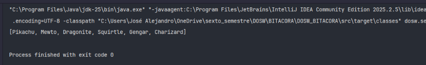

**Explicación:** Se mapea cada objeto `Pokemon` a su nombre con `map(Pokemon::getNombre)` y se colecta la salida especificando `Collectors.toCollection(ArrayList::new)`.

---

### Ejercicio 11 – Promedio de Poder de Combate (PC)  [Method ]

Dada una cadena formateada con un arreglo de valores de PC, procesar el texto y calcular el promedio numérico del Poder de Combate.

**Código implementado:**

```java
package _2.pokemon;

import java.text.DecimalFormat;
import java.util.List;
import java.util.stream.Stream;

public class Ejercisio11 {

    public static void main(String[] args){

        DecimalFormat db = new DecimalFormat("#,##0.##");

        String powerCombat = "PC: [320, 680, 530, 210, 495, 610]";
        powerCombat = powerCombat.replace("PC:","")
                .replace("[","").replace("]","")
                .trim();

        double powerCombatAverage = Stream.of(powerCombat.split(","))
                .mapToDouble(Double::parseDouble)
                .average().orElse(0.0);

        System.out.printf("Poder de combate promedio: " + db.format(powerCombatAverage));

    }
}
```

**Captura de ejecución:**

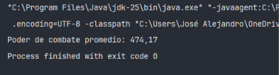

**Explicación:** Se limpia la cadena eliminando corchetes y encabezados. Posteriormente, se genera un stream dividiendo el texto por comas (`split(",")`), convirtiendo cada valor a `Double` con `mapToDouble()` y calculando el promedio con `.average()`.

---

### Ejercicio 12 – Determinación del Campeón por Poder de Combate

Dada una lista de Pokémon con su valor de PC entre paréntesis, encontrar el Pokémon con el valor máximo de PC y proclamarlo campeón.

**Código implementado:**

```java
package _2.pokemon;

import java.util.Comparator;
import java.util.List;
import java.util.function.Function;

public class Ejercisio12 {
    public static void main(String[] args){

        Function<String,Integer> getLevel = pokemon -> {
            String substring = pokemon.substring(pokemon.indexOf("(") + 1, pokemon.indexOf(")"));
            return Integer.parseInt(substring);
        };

        List<String> pokemons = List.of("Pikachu(320)", "Mewtwo(680)",
                "Dragonite(530)", "Charizard(610)"
        );

        String pokemonsHigherPower = pokemons.stream()
                .max(Comparator.comparing(getLevel)).orElse("Ninguno gano");

        System.out.println("Campeon: " + pokemonsHigherPower.substring(0,pokemonsHigherPower.indexOf("(")) + " con PC: " + getLevel.apply(pokemonsHigherPower));
    }
}
```

**Captura de ejecución:**

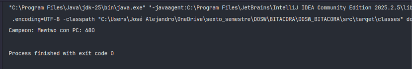

**Explicación:** Se utiliza la función `max()` especificando un comparador basado en la extracción del PC entero desde el texto del objeto.

---

### Ejercicio 13 – Agrupamiento de Pokémon por Tipo (`groupingBy`)  [Method ]

Agrupar una lista de Pokémon por su tipo (Agua, Fuego, Planta) en un mapa ordenado (`TreeMap`).

**Código implementado:**

```java
package _2.pokemon;

import java.util.List;
import java.util.Map;
import java.util.TreeMap;
import java.util.function.Function;
import java.util.stream.Collectors;

public class Ejercisio13 {

    public static void main(String[] args){

        List<String> pokemons = List.of("Squirtle(Agua)", "Psyduck(Agua)",
                "Charmander(Fuego)", "Vulpix(Fuego)",
                "Bulbasaur(Planta)"
        );

        Function<String,String> getTypePokemon = pokemon -> {
            return pokemon.substring(pokemon.indexOf("(") + 1, pokemon.indexOf(")"));
        };

        Map<String,List<String>> pokemonsByTypes = pokemons.stream()
                .collect(Collectors.groupingBy(
                        pokemon -> getTypePokemon.apply(pokemon),
                        TreeMap::new,
                        Collectors.mapping(pokemon -> pokemon.substring(0,pokemon.indexOf("(")),Collectors.toList())
                ));

        pokemonsByTypes.forEach((key, value) -> System.out.println(key + ":" + " " + value));
    }
}
```

**Captura de ejecución:**

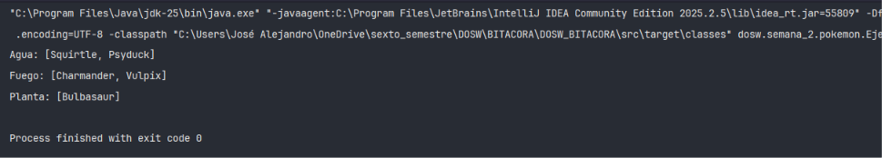

**Explicación:** Se utiliza `Collectors.groupingBy` agrupando por la clave obtenida de `getTypePokemon`, almacenando las claves en un `TreeMap` e introduciendo en las listas de valores únicamente los nombres formateados.

---

### Ejercicio 14 – Agrupamiento de Pokémon por Región  [Method ]

Dada una lista de Pokémon con su región de origen entre paréntesis (Kanto, Johto, Hoenn, Sinnoh), agruparlos manteniendo el orden de inserción (`LinkedHashMap`).

**Código implementado:**

```java
package _2.pokemon;

import java.util.LinkedHashMap;
import java.util.List;
import java.util.Map;
import java.util.function.Function;
import java.util.stream.Collectors;

public class Ejercisio14 {

    public static void main(String[] args){

        List<String> pokemons = List.of("Pikachu(Kanto)", "Chikorita(Johto)",
                "Torchic(Hoenn)", "Piplup(Sinnoh)",
                "Charmander(Kanto)", "Totodile(Johto)"
        );

        Function<String,String> getPokemonRegion = pokemon -> {
            return pokemon.substring(pokemon.indexOf("(") + 1, pokemon.indexOf(")"));
        };

        Map<String, List<String>> pokemonByRegions = pokemons.stream()
                .collect(Collectors.groupingBy(
                        getPokemonRegion,
                        LinkedHashMap::new,
                        Collectors.mapping(pokemon -> pokemon.substring(0,pokemon.indexOf("(")), Collectors.toList())
                ));

        pokemonByRegions.forEach((key,value) ->
                System.out.println(key + ": " + value));
    }
}
```

**Captura de ejecución:**

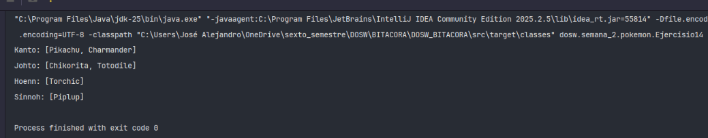

**Explicación:** Se agrupan los Pokémon utilizando la función de extracción de región como clave. Se especifica `LinkedHashMap::new` para conservar el orden secuencial de aparición de las regiones.

---

### Ejercicio 15 – Identificación del Campeón de Gimnasios (Más Medallas)  [Method ]

Dada una lista de objetos `Entrenador`, encontrar al entrenador con el mayor número de medallas obtenidas.

**Código implementado:**

```java
package semana_2.pokemon;

import java.util.Comparator;
import java.util.List;

public class Ejercisio15 {

    public static void main(String[] args){
        List<Entrenador> coachs = List.of(
                new Entrenador(0L,"Ash",8,null),
                new Entrenador(1L,"Misty",5,null),
                new Entrenador(2L,"Brock",6,null),
                new Entrenador(3L,"Gary",10,null)
        );

        Entrenador coachHigherMedals = coachs.stream()
                .max(Comparator.comparing(Entrenador::getMedallas)).orElse(null);

        System.out.println("Campeon de gimnasios: " + coachHigherMedals.getNombre());
        System.out.println("Medallas obtenidas: " + coachHigherMedals.getMedallas());
    }
}
```

**Captura de ejecución:**

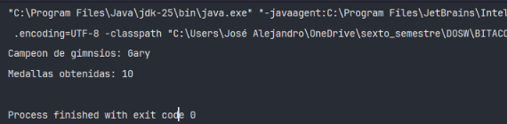

**Explicación:** Se aplica la función `max` sobre el stream de entrenadores comparando la propiedad `medallas` obtenida mediante la referencia a método `Entrenador::getMedallas`.

---

### Ejercicio 16 – Entrenadores destacados con más de 5 Medallas

Filtrar aquellos entrenadores que tengan estrictamente más de 5 medallas y retornar sus nombres junto con el número de medallas.

**Código implementado:**

```java
package semana_2.pokemon;

import java.util.List;

public class Ejercisio16 {

    public static void main(String[] args){

        List<Entrenador> coachs = List.of(
                new Entrenador(0L,"Ash",8,null),
                new Entrenador(1L,"Misty",5,null),
                new Entrenador(2L,"Brock",6,null),
                new Entrenador(3L,"Gary",10,null),
                new Entrenador(3L,"Dawn",7,null)
        );

        List<String> coachWithMoreFiveMedals = coachs.stream()
                .filter(coach -> coach.getMedallas() > 5)
                .map(coach -> coach.getNombre() + "(" + coach.getMedallas() + ")")
                .toList();

        System.out.println("Entrenadores con > 5 medallas:");
        System.out.println(coachWithMoreFiveMedals);
    }
}
```

**Captura de ejecución:**

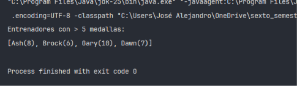

**Explicación:** Se filtra la lista con el predicado `coach.getMedallas() > 5` y se le aplica un mapa de formateo para presentar el nombre y las medallas entre paréntesis.

---

### Ejercicio 17 – Entrenador más Poderoso por PC Total del Equipo  [Method ]

Determinar cuál es el entrenador cuyo equipo Pokémon posee el mayor poder de combate acumulado.

**Código implementado:**

```java
package semana_2.pokemon;

import java.text.DecimalFormat;
import java.util.Comparator;
import java.util.List;

public class Ejercisio17 {

    public static void main(String[] args){
        DecimalFormat db = new DecimalFormat("###0.##");

        List<Entrenador> coachs = List.of(
                new Entrenador(0L,"Ash",8,List.of(new Pokemon(1L,"pokemon","nose",1,1850,"nose",false))),
                new Entrenador(1L,"Misty",5,List.of(new Pokemon(1L,"pokemon","nose",1,2340,"nose",false))),
                new Entrenador(2L,"Brock",6,List.of(new Pokemon(1L,"pokemon","nose",1,1670,"nose",false)))
        );

        Entrenador coachesHighestPowerComabt = coachs.stream()
                .max(Comparator.comparing(Entrenador::getSumTotalPowerTeam)).orElse(null);

        System.out.println("Entrenador mas poderoso: " + coachesHighestPowerComabt.getNombre());
        System.out.println("Poder acumulado del equipo: " + db.format(coachesHighestPowerComabt.getSumTotalPowerTeam()));
    }
}
```

**Captura de ejecución:**

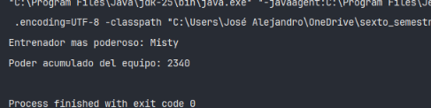

**Explicación:** Se invoca el método helper `getSumTotalPowerTeam()` en la clase `Entrenador` (que calcula la suma de los PC del equipo) y se obtiene el máximo con `Comparator.comparing()`.

---

### Ejercicio 18 – Ranking Top 5 Pokémon más Poderosos  [Method ]

Dada una lista de objetos `Pokemon`, ordenar la lista de manera descendente según su poder de combate y limitar la salida a los 5 más poderosos.

**Código implementado:**

```java
package semana_2.pokemon;

import java.util.Comparator;
import java.util.List;

public class Ejercisio18 {

    public static void main(String[] args){

        List<Pokemon> pokemonList = List.of(
                new Pokemon(1L,"Mewtwo","nose",1,680,"nose",false),
                new Pokemon(1L,"Charizard","nose",1,610,"nose",false),
                new Pokemon(1L,"Dragonite","nose",1,530,"nose",false),
                new Pokemon(1L,"Gengar","nose",1,495,"nose",false),
                new Pokemon(1L,"Pikachu","nose",1,320,"nose",false)
        );

        pokemonList.stream()
            .sorted(Comparator.comparing(Pokemon::getPoderCombate).reversed())
            .limit(5)
            .forEach(pokemon -> System.out.println(pokemon.getNombre() + " - PC: " + pokemon.getPoderCombate() ));
    }
}
```

**Captura de ejecución:**

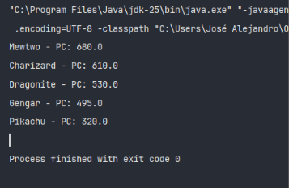

**Explicación:** Se ordenan los elementos de mayor a menor PC con `.sorted(Comparator.comparing(...).reversed())`, se limita la cantidad a 5 elementos con `limit(5)` y se imprimen individualmente.

---

### Ejercicio 19 – Podio de Entrenadores (Criterio Múltiple)  [Method ]

Construir el podio (Top 3) de entrenadores aplicando un ordenamiento con múltiples criterios: primero por número de medallas, luego por poder total del equipo y finalmente por nombre.

**Código implementado:**

```java
package semana_2.pokemon;

import java.text.DecimalFormat;
import java.util.Comparator;
import java.util.List;

public class Ejercisio19 {

    public static void main(String[] args){

        DecimalFormat db = new DecimalFormat("###0.##");

        List<Entrenador> coachs = List.of(
                new Entrenador(0L,"Gary",10,List.of(new Pokemon(1L,"pokemon","nose",1,2340,"nose",false))),
                new Entrenador(1L,"Ash",8,List.of(new Pokemon(1L,"pokemon","nose",1,1850,"nose",false))),
                new Entrenador(2L,"Dawn",7,List.of(new Pokemon(1L,"pokemon","nose",1,2100,"nose",false))),
                new Entrenador(2L,"Brock",6,List.of(new Pokemon(1L,"pokemon","nose",1,1670,"nose",false)))
        );

        coachs.stream()
                .sorted(Comparator.comparing(Entrenador::getMedallas)
                        .thenComparing(Entrenador::getSumTotalPowerTeam)
                        .thenComparing(Entrenador::getNombre)
                        .reversed())
                .limit(3)
                .forEach(entrenador -> System.out.println(entrenador.getNombre() + " - " + entrenador.getMedallas() + " medallas, " + " PC: " + db.format(entrenador.getSumTotalPowerTeam())));
    }
}
```

**Captura de ejecución:**

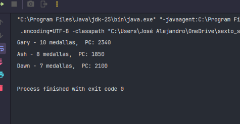

**Explicación:** Se utilizan comparadores encadenados (`thenComparing`) para establecer el orden de desempate y se extraen los primeros 3 resultados con `limit(3)`.

---

### Ejercicio 20 – Reporte Estadístico Completo de Pokémon  [Method ]

Generar un informe analítico completo que calcule: distribución de Pokémon por tipo, distribución por región, total de legendarios, promedio general de nivel y el Pokémon con el mayor poder de combate.

**Código implementado:**

```java
package semana_2.pokemon;

import java.text.DecimalFormat;
import java.util.Comparator;
import java.util.LinkedHashMap;
import java.util.List;
import java.util.Map;
import java.util.stream.Collectors;

public class Ejercisio20 {

    public static void main(String[] args){

        DecimalFormat db = new DecimalFormat("#,##0.#");

        List<Pokemon> pokemons = List.of(
                new Pokemon(1L,"Pikachu","Fuego",85,58.4,"Kanto",true),
                new Pokemon(1L,"Mewwwto","Fuego",70,58.4,"Kanto",true),
                new Pokemon(1L,"Dragonite","Fuego",60,58.4,"Kanto",false),
                new Pokemon(1L,"Squirtle","Fuego",55,58.4,"Kanto",false),
                new Pokemon(1L,"Gengar","Agua",50,58.4,"Kanto",false),
                new Pokemon(1L,"Mewt4o","Agua",45,58.4,"Jonto",false),
                new Pokemon(1L,"Mewto","Agua",44,680,"Jonto",false)
        );

        Map<String,Long> pokemonsByType = pokemons.stream()
                .collect(Collectors.groupingBy(
                        Pokemon::getTipo,
                        LinkedHashMap::new,
                        Collectors.counting()
                ));

        Map<String,Long> pokemonsByRegion = pokemons.stream()
                .collect(Collectors.groupingBy(
                        Pokemon::getRegion,
                        LinkedHashMap::new,
                        Collectors.counting()
                ));

        long amountLegenPokemons = pokemons.stream()
                .filter(Pokemon::isLegendario)
                .count();

        double averageLevelPokemons = pokemons.stream()
                .mapToDouble(Pokemon::getNivel)
                .average().orElse(0.0);

        Pokemon strongestPokemon = pokemons.stream()
                .max(Comparator.comparing(Pokemon::getPoderCombate)).orElse(null);

        System.out.println("Por tipo: " + pokemonsByType);
        System.out.println("Por Region: " + pokemonsByRegion);
        System.out.println("Legendarios: " + amountLegenPokemons);
        System.out.println("Promedio niv: " + db.format(averageLevelPokemons));
        System.out.println("Mas fuerte: " + strongestPokemon.getNombre() + " (PC: " + strongestPokemon.getPoderCombate() + ")");
    }
}
```

**Captura de ejecución:**

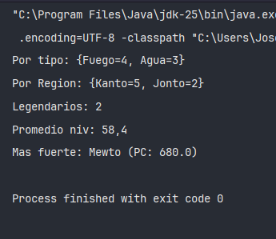

**Explicación:** Se combinan múltiples colecciones y reducciones de Streams Java (tales como `groupingBy` con `counting()`, `mapToDouble()` con `average()`, `filter()` con `count()` y `max()`) para construir un resumen analítico completo.

---

### RETO MEWTWO (+1.0 punto) – Operación Táctica: Sistema de Proyección y Élite Regional

El Profesor Oak y el Alto Mando de la Liga Pokémon DOSW exigen un generador de reportes analíticos de élite. Dada una lista de objetos `Pokemon` (usando la clase tradicional del taller), el sistema debe procesar el flujo aplicando estrictamente en una sola cadena de Streams lo siguiente:

- **filter()**: Filtrar únicamente los Pokémon cuyo nivel sea estrictamente mayor a 50 (descartando novatos).
- **map()**: Transformar el objeto `Pokemon` en una clase auxiliar de proyección (`ReportePokemon`), aplicando una transformación real: convertir el nombre del Pokémon por completo a mayúsculas y aislar sus métricas de combate.
- **sorted()**: Ordenar el flujo resultante de manera descendente basándose en su poder de combate (`poderCombate`).
- **groupingBy()**: Agrupar los reportes resultantes según su región de origen (`region`).
- **reduce()** (aplicado mediante `Collectors.reducing`): Ejecutar una reducción binaria dentro de cada grupo regional para aislar y seleccionar únicamente al Pokémon con el mayor poder de combate de su respectiva región.

**Código implementado (`RetoMewtwo.java`):**

```java
package semana_2.pokemon;

import java.util.*;
import java.util.stream.Collectors;

class ReportePokemon {
    private String nombreMayuscula;
    private String region;
    private double poderCombate;

    public ReportePokemon(String nombreMayuscula, String region, double poderCombate) {
        this.nombreMayuscula = nombreMayuscula;
        this.region = region;
        this.poderCombate = poderCombate;
    }

    public String getNombreMayuscula() { return nombreMayuscula; }
    public String getRegion() { return region; }
    public double getPoderCombate() { return poderCombate; }
}

public class RetoMewtwo {

    public static Map<String, Optional<ReportePokemon>> generarReporteElite(List<Pokemon> listaPokemones) {
        return listaPokemones.stream()
            .filter(p -> p.getNivel() > 50)
          
            .map(p -> new ReportePokemon(
                p.getNombre().toUpperCase(), 
                p.getRegion(), 
                p.getPoderCombate()
            ))
          
            .sorted(Comparator.comparingDouble(ReportePokemon::getPoderCombate).reversed())
          
            .collect(Collectors.groupingBy(
                ReportePokemon::getRegion,
                Collectors.reducing((r1, r2) -> r1.getPoderCombate() > r2.getPoderCombate() ? r1 : r2)
            ));
    }

    public static void main(String[] args) {
        List<Pokemon> equipo = List.of(
            new Pokemon(1L, "Mewtwo", "Psíquico", 85, 680.0, "Kanto", true),
            new Pokemon(2L, "Charizard", "Fuego", 75, 610.0, "Kanto", false),
            new Pokemon(3L, "Pikachu", "Eléctrico", 45, 320.0, "Kanto", false),
            new Pokemon(4L, "Typhlosion", "Fuego", 70, 540.0, "Johto", false),
            new Pokemon(5L, "Feraligatr", "Agua", 68, 520.0, "Johto", false),
            new Pokemon(6L, "Blaziken", "Fuego", 80, 590.0, "Hoenn", false)
        );

        Map<String, Optional<ReportePokemon>> resultado = generarReporteElite(equipo);

        System.out.println("=== REPORTE TÁCTICO DE ÉLITE (RETO MEWTWO) ===");
        resultado.forEach((region, reporteOpt) -> {
            reporteOpt.ifPresent(r -> 
                System.out.println("Región: " + region + " ➔ Campeón: " + r.getNombreMayuscula() + " [PC: " + r.getPoderCombate() + "]")
            );
        });
    }
}
```

**Captura**

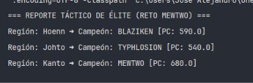

**Explicación:**

- **Transformación Activa (`.map`)**: En lugar de simular un retorno vacío, la operación `.map()` cumple un rol arquitectónico clave al transformar los objetos de entidad `Pokemon` en instancias de la clase tradicional `ReportePokemon`, realizando un formateo activo (`p.getNombre().toUpperCase()`) sobre los datos.
- **Integración Funcional Coherente**: El pipeline combina de manera limpia la fase de filtrado de novatos (`filter`), la proyección de datos (`map`), el ordenamiento descendente (`sorted`) y, finalmente, la consolidación mediante `Collectors.groupingBy` empalmado con `Collectors.reducing` (reducción binaria interna) para extraer al contendiente con mayor poder de combate por cada región.


# SEMANA No 3 – Patrones de Diseño y Principios SOLID

## Datos personales:
- **Nombre y Apellido:** Jose Alejandro Martinez Arias
- **Código de Estudiante:** 1000104385
- **Curso:** DOSW

---

### Ejercicio 01 – Patrón Factory Method (Creacional)

Implementación del patrón **Factory Method** para desvincular la creación de procesadores de pago (`CreditCardProccesor`, `PayPalProcessor`, `BankTransferProcessor`) de la lógica principal de cobro.

**Código implementado (`MainClass.java`):**
```java
package dosw.semana_3.creational.ejercisio01FactoryMethod;

public class MainClass {

    public static void main(String[] args){

        PaymentProcessor processor;

        processor = new CreditCardProccesor();
        processor.proccessPayment(100);

        processor = new PayPalProcessor();
        processor.proccessPayment(250);

        processor = new BankTransferProcessor();
        processor.proccessPayment(500);
    }
}
```

**Captura de ejecución:**


**Explicación:** Se define la clase abstracta `PaymentProcessor` con el método de fábrica `createPayment()`. Cada subclase concreta (`CreditCardProccesor`, `PayPalProcessor`, etc.) instancia su respectivo tipo de pago (`Payment`), cumpliendo con el principio de Inversión de Dependencias y de Abierto/Cerrado (OCP).

---

### Ejercicio 02 – Patrón Abstract Factory (Creacional)

Implementación del patrón **Abstract Factory** para la creación de familias de objetos relacionados pertenecientes a plataformas de videojuegos (`PlayStationFactory` y `XboxFactory`).

**Código implementado (`Main.java`):**
```java
package dosw.semana_3.creational.ejercisio02AbstractFactory;

public class Main {

    public static void main(String[] args){

        ConsoleFactory factory;

        factory = new PlayStationFactory();
        GameEngine psEngine = new GameEngine(factory);
        psEngine.run();

        System.out.println("-----");

        factory = new XboxFactory();
        GameEngine xboxEngine = new GameEngine(factory);
        xboxEngine.run();
    }
}
```

**Captura de ejecución:**


**Explicación:** La interfaz `ConsoleFactory` declara métodos para crear controles (`Controller`), juegos (`Game`) e interfaz de usuario (`UI`). Las fábricas concretas garantizan que los productos de una misma plataforma sean compatibles entre sí sin acoplar el cliente a clases concretas.

---

### Ejercicio 03 – Patrón Builder (Creacional)

Implementación del patrón **Builder** para la construcción paso a paso de objetos complejos de juguetes (`ToyDoll`).

**Código implementado (`ToyDollBuilder.java`):**
```java
package dosw.semana_3.creational.ejercisio03Builder;

public interface ToyDollBuilder {

    void builHead(String head);
    void buildBody(String body);
    void buildArms(String arms);
    void buildLegs(String legs);
    void hasAccesories(boolean hasAccesories);
}
```

**Captura de ejecución:**


**Explicación:** Se separa el proceso de construcción de un objeto `ToyDoll` de su representación final. Mediante las clases constructoras concretas (`ActionDollBuilder`, `ClassDollBuilder`) y el director (`ToyFactory`), es posible producir distintos tipos de muñecos manteniendo un proceso de ensamblaje uniforme.

---

### Ejercicio 04 – Patrón Adapter (Estructural)

Implementación del patrón **Adapter** para permitir que cargadores de vehículos eléctricos (`FastElectricCharger` y `SlowElectricCharger`) funcionen de manera transparente con la interfaz unificada de una estación de servicio (`FuelService`).

**Código implementado (`SmartGasStation.java`):**
```java
package dosw.semana_3.estructural.ejercisio04Adapter;

public class SmartGasStation {

    public static void main(String[] args){

        FuelService gasolinePump = new GasPump();

        FuelService fastElectricPump = new FastChargerAdapter(new FastElectricCharger());

        FuelService slowElectricPump = new SlowChargerAdapter(new SlowElectricCharger());

        gasolinePump.supply(30);
        fastElectricPump.supply(30);
        slowElectricPump.supply(30);
    }
}
```

**Captura de ejecución:**


**Explicación:** Las clases adaptadoras (`FastChargerAdapter` y `SlowChargerAdapter`) implementan la interfaz requerida por el cliente (`FuelService`) y delegan la ejecución a las clases adaptadas (`FastElectricCharger` / `SlowElectricCharger`), resolviendo incompatibilidades de interfaz sin modificar el código preexistente.

---

### Ejercicio 05 – Patrón Bridge (Estructural)

Implementación del patrón **Bridge** para desacoplar la abstracción de formas geométricas (`Forma`) de su implementación de color (`Color`).

**Código implementado (`Main.java`):**
```java
package dosw.semana_3.estructural.ejercisio05Bridge;

public class Main {

    public static void main(String[] args){

        Forma circuloRojo = new Circulo(new Rojo());
        Forma cuadradoRojo = new Cuadrado(new Rojo());

        Forma circuloAzul = new Circulo(new Azul());
        Forma cuadradoAzul = new Cuadrado(new Azul());

        circuloRojo.dibujar();
        cuadradoRojo.dibujar();
        circuloAzul.dibujar();
        cuadradoAzul.dibujar();
    }
}
```

**Captura de ejecución:**


**Explicación:** Se evita la explosión combinatoria de clases jerárquicas asociando una referencia de la interfaz `Color` dentro de la jerarquía abstracta `Forma`. De esta manera, las formas (`Circulo`, `Cuadrado`) y los colores (`Rojo`, `Azul`) evolucionan independientemente.

---

### Ejercicio 06 – Patrón Composite (Estructural)

Implementación del patrón **Composite** para representar estructuras jerárquicas de tipo árbol en un sistema de inventario de almacén (`WharehouseApp`).

**Código implementado (`WharehouseApp.java`):**
```java
package dosw.semana_3.estructural.ejercisio06Composite;

public class WharehouseApp {

    public static void main(String[] args){

        Product laptop = new Product("Laptop", 1200);
        Product mouse = new Product("Mouse", 40);
        Product keyboard = new Product("keyboard", 80);

        Box accesoriesBox = new Box("Accesories Box");
        accesoriesBox.add(mouse);
        accesoriesBox.add(keyboard);

        Box mainBox = new Box("Main Box");
        mainBox.add(laptop);
        mainBox.add(accesoriesBox);

        System.out.println("Total price: $" + mainBox.getPrice());
    }
}
```

**Captura de ejecución:**


**Explicación:** Mediante la interfaz común `Item`, tanto los elementos simples (`Product`) como los contenedores compuestos (`Box`) son tratados de manera uniforme, permitiendo calcular el costo total de cajas anidadas recursivamente.

---

### Ejercicio 07 – Patrón Decorator (Estructural)

Implementación del patrón **Decorator** para agregar atributos y funcionalidades adicionales (blindaje, radar, misiles, antitorpedos) a una embarcación (`Barco`) de manera dinámica.

**Código implementado (`Main.java`):**
```java
package dosw.semana_3.estructural.ejercisio07Decorator;

import java.util.List;
import java.util.Map;
import java.util.function.Function;

public class Main {

    public static void main(String[] args){

        Barco barcoBase = new BarcoBase();

        Map<String, Function<Barco,Barco>> mejoras = Map.of(
                "BLINDAJE", BlindajeDecorator::new,
                "RADAR", RadarDecorator::new,
                "MISILES", MisilesDecorator::new,
                "ANTITORPERDOS", AntiTorpedosDecorator::new
        );

        List<String> configuracion = List.of(
                "BLINDAJE",
                "RADAR",
                "MISILES"
        );

        Barco barcoFinal = barcoBase;
        for (String clave : configuracion) {
            Function<Barco, Barco> decorador = mejoras.get(clave);
            if (decorador != null) {
                barcoFinal = decorador.apply(barcoFinal);
            }
        }

        System.out.println(barcoFinal.getDescription());
        System.out.println("Ataqueda: " + barcoFinal.poderAtaque());
        System.out.println("Defensas: " + barcoFinal.defensa());
    }
}
```

**Captura de ejecución:**


**Explicación:** La clase abstracta `BarcoBaseDecorator` implementa la interfaz `Barco` y envuelve un objeto base. Los decoradores concretos incrementan dinámicamente las estadísticas de ataque y defensa sin alterar la estructura original de `BarcoBase`.

---

### Ejercicio 08 – Patrón Chain of Responsibility (Comportamiento)

Implementación del patrón **Chain of Responsibility** para procesar secuencialmente solicitudes de control migratorio (`IngresoRequest`).

**Código implementado (`Main.java`):**
```java
package dosw.semana_3.comportamiento.ejercisio08ChainOfResponsability;

public class Main {

    public static void main(String[] args){

        ControlMigratorio pasaporte = new PasaporteControl();
        ControlMigratorio antecedentes = new AntecedentesControl();
        ControlMigratorio motivo = new MotivoViajeControl();
        ControlMigratorio aprobacion = new AprobacionFinalControl();

        pasaporte.setSiguiente(antecedentes);
        antecedentes.setSiguiente(motivo);
        motivo.setSiguiente(aprobacion);

        IngresoRequest persona = new IngresoRequest(
                true,
                true,
                false
        );

        pasaporte.processar(persona);
    }
}
```

**Captura de ejecución:**


**Explicación:** Cada eslabón de la cadena (`PasaporteControl`, `AntecedentesControl`, `MotivoViajeControl`, `AprobacionFinalControl`) decide si procesar la solicitud o pasarla al siguiente manejador, desacoplando al emisor de la petición de sus receptores.

---

### Ejercicio 09 – Patrón Command (Comportamiento)

Implementación del patrón **Command** para encapsular acciones de un personaje de juego (`WalkCommand`, `JumpCommand`, `AttackCommand`, `DefendCommand`) como objetos independientes.

**Código implementado (`Main.java`):**
```java
package dosw.semana_3.comportamiento.ejercicio09Command;

import java.util.List;

public class Main {

    public static void main(String[] args){

        GameCharacter character = new GameCharacter();
        GameController controller = new GameController();

        List<Command> actions = List.of(
                new WalkCommand(character),
                new JumpCommand(character),
                new AttackCommand(character),
                new DefendCommand(character)
        );

        actions.forEach(controller::PressButton);
    }
}
```

**Captura de ejecución:**


**Explicación:** Las operaciones sobre `GameCharacter` se transforman en objetos que implementan la interfaz `Command`. El `GameController` invoca la ejecución sin necesitar conocer los detalles internos de las acciones del personaje.

---

### Ejercicio 10 – Patrón Iterator (Comportamiento)

Implementación del patrón **Iterator** para recorrer los lugares turísticos de una ruta (`TourRoute`) de forma secuencial.

**Código implementado (`Main.java`):**
```java
package dosw.semana_3.comportamiento.ejercicio10Iterator;

public class Main {

    public static void main(String[] args){
        TourRoute roma = new TourRoute();
        Tourist tourist = new Tourist();

        tourist.exploreTour(roma);
    }
}
```

**Captura de ejecución:**


**Explicación:** El patrón encapsula los detalles de recorrido de los sitios turísticos detrás de la interfaz `Iterator`, permitiendo que el objeto `Tourist` itere sobre los destinos sin exponer la estructura de datos interna del objeto `TourRoute`.

---

### Ejercicio 11 – Patrón Strategy (Comportamiento)

Implementación del patrón **Strategy** en una aplicación de navegación marítima o terrestre (`NavigationApp`) para seleccionar dinámicamente el algoritmo de cálculo de rutas.

**Código implementado (`Main.java`):**
```java
package dosw.semana_3.comportamiento.ejercicio11Estrategy;

public class Main {

    public static void main(String[] args){

        NavigationApp app = new NavigationApp(new FastestRoute());
        app.startNavigation();

        app.setRouteStragey(new ScenicRoute());
        app.startNavigation();

        app.setRouteStragey(new CheapestRoute());
        app.startNavigation();
    }
}
```

**Captura de ejecución:**


**Explicación:** Se define la interfaz `RouteStragey` y sus estrategias concretas (`FastestRoute`, `ScenicRoute`, `CheapestRoute`). `NavigationApp` puede modificar su estrategia en tiempo de ejecución de manera flexible sin alterar la aplicación cliente.
